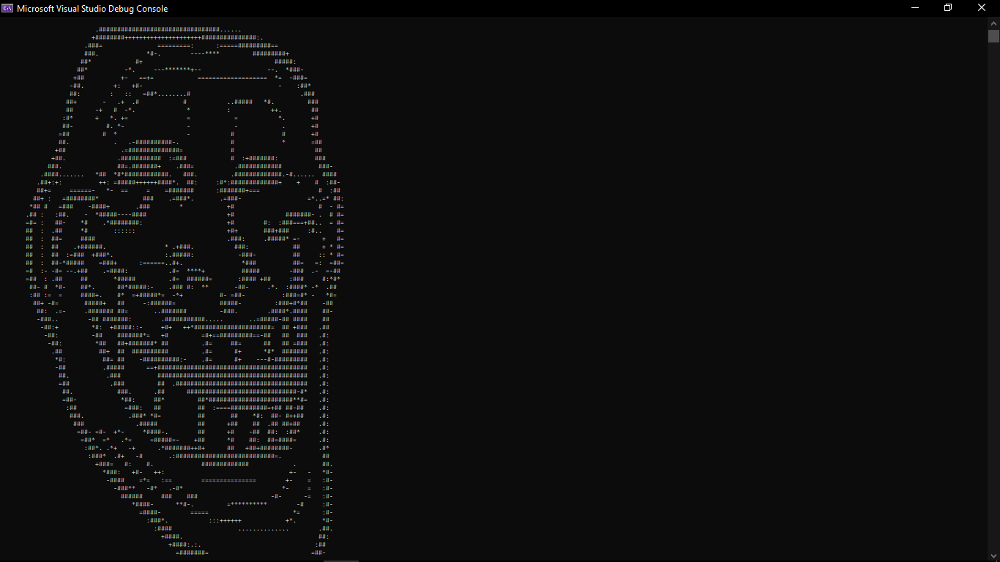
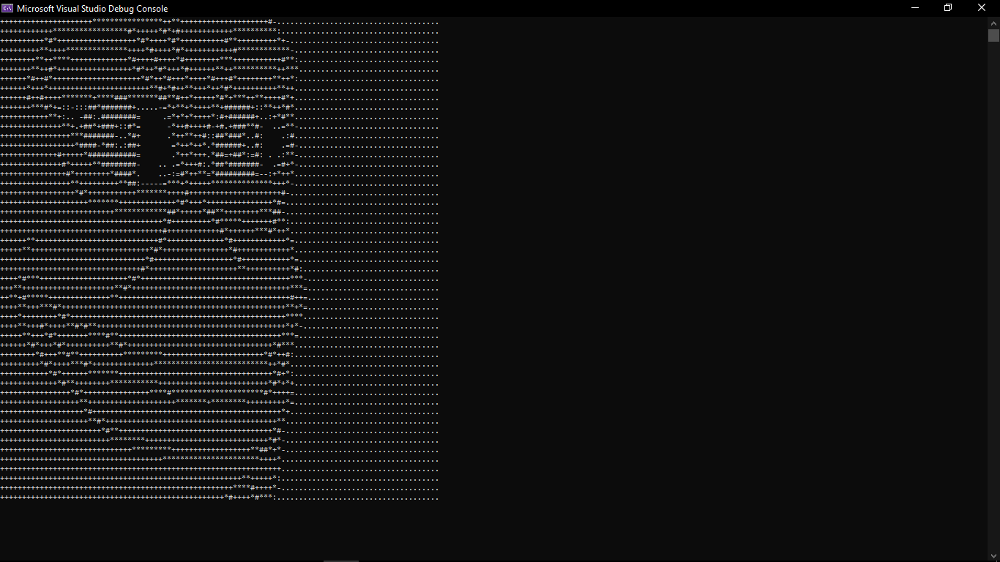
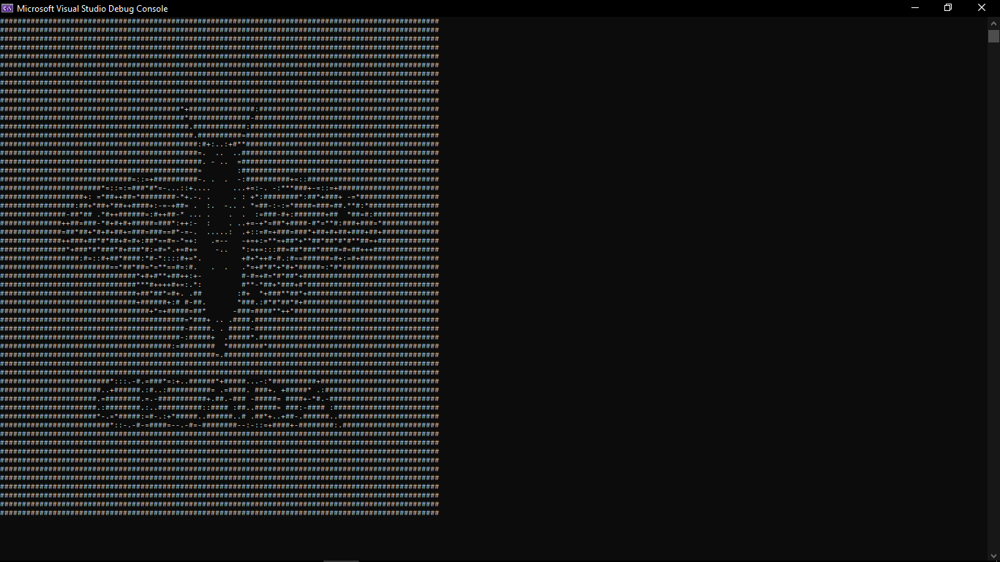

# ASCIIGenerator

A simple C# console application that converts images into ASCII art. Adjust the output width and optionally reverse the colors to customize the result. The ASCII art is saved as a text file in a **Generated** folder.

---

## Features

- Converts images to ASCII art  
- Adjustable output width  
- Optional color inversion  
- Saves ASCII art as `.txt` files  

---

## Usage

1. Run the program.  
2. Enter the image file path or press Enter to use the default image.  
3. Specify the ASCII art width or press Enter to use the default width (35).  
4. Choose whether to reverse colors (enter 'y' for yes or press Enter for default true).  
5. View the generated ASCII art in the console and find the saved `.txt` file in the **Generated** folder.

---

## Screenshots

---

## Requirements

- .NET Framework or .NET Core compatible with `System.Drawing`  
- Windows or other OS supporting `System.Drawing`  

---

## License

MIT License
